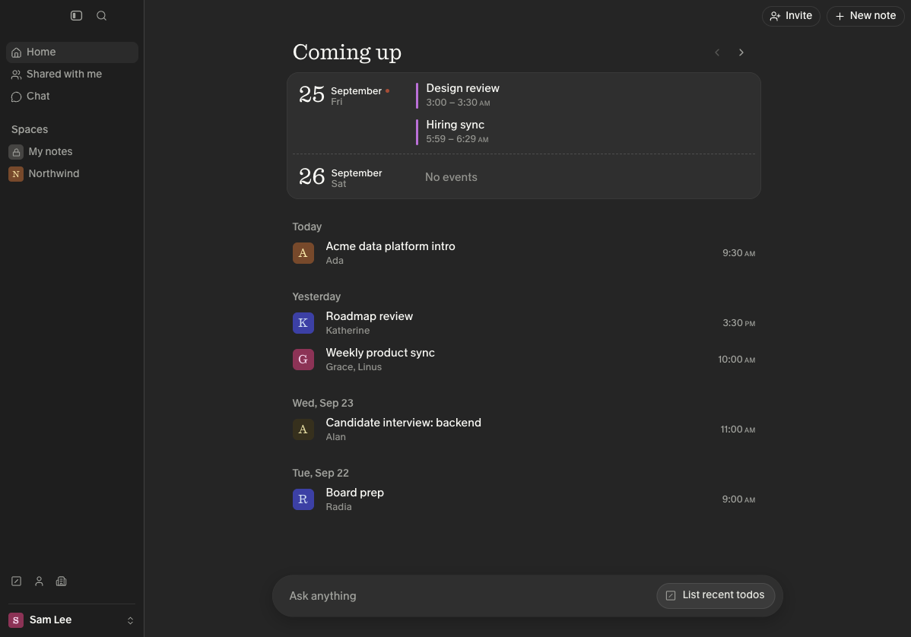
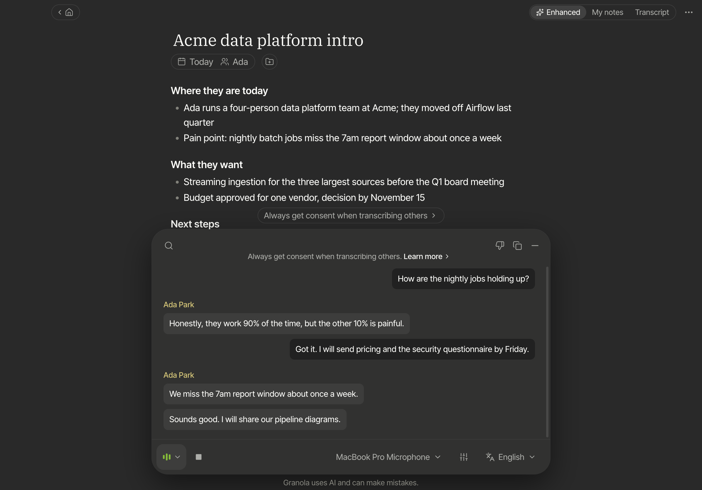
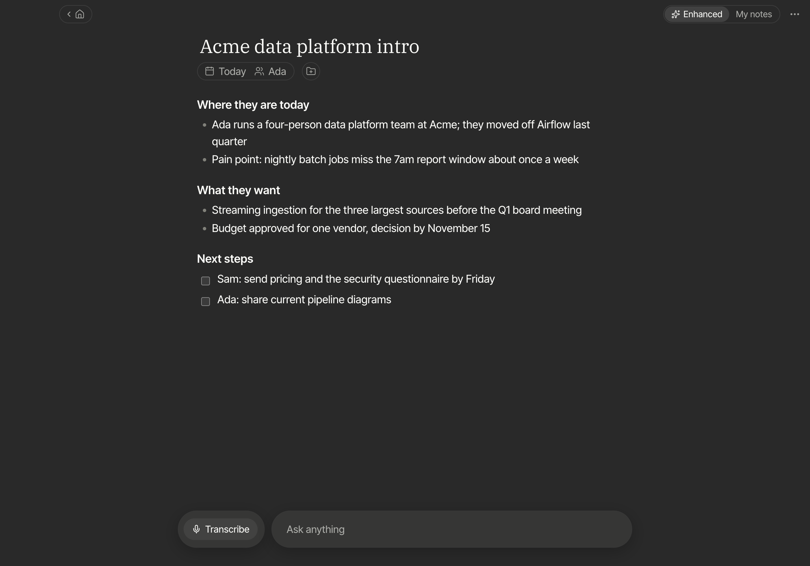
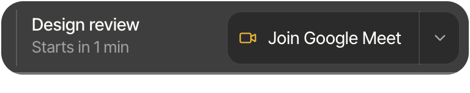

# Slop Granola

An open-source clone of [Granola](https://granola.ai), the AI notepad for meetings, for
Macs with Apple Silicon. It transcribes your microphone as "Me" and your computer's audio
as the other side of the call, live, then turns your rough notes and the transcript into
meeting notes. You choose where transcription and the language model run: fully on your
own Mac, on a GPU box you own, or on cloud APIs with your own keys.

This project is not affiliated with or endorsed by Granola. The name, look and feel are
theirs; this repository exists to study how the product works.

| | |
|---|---|
|  |  |
|  |  |

## Features

- Two-channel live transcription with echo suppression, so the far side coming out of
  your speakers is not transcribed twice. On a 1:1 call the other side is labelled with
  the attendee's name from the invite.
- Enhanced notes that expand what you wrote with specifics from the transcript, plus
  templates, recipes, and chat across all your meetings.
- Calendar through macOS EventKit. When an app such as Zoom or a Meet tab starts using
  the mic, a prompt slides in offering to take notes, or to join the meeting that is about
  to start.
- A menu bar item with today's meetings, and a floating widget with the live transcript
  while you record.
- Full-text search, spaces and folders, and people and companies built from invites.
- Everything is stored locally in SQLite. API keys are encrypted with a key held in the
  macOS Keychain.

## Choose your backends

Transcription and notes are configured separately in **Settings → Connectors**.

| Transcription | Needs | Notes |
|---|---|---|
| This Mac | Apple Silicon, [uv](https://docs.astral.sh/uv/) | Parakeet TDT 0.6B on MLX via `server/scripts/run-local.sh`. About 130 ms to interim text, 0.5 s to finals on an M-series laptop. |
| Self-hosted GPU server | NVIDIA GPU, Docker | Parakeet for interims, Granite Speech 4.1 for finals. See [`server/README.md`](server/README.md). |
| Deepgram | API key | Nova-3 streaming. |
| Google Cloud Speech-to-Text | GCP project | Chirp 3 streaming. Uses a service-account file or `gcloud` credentials. |

| Notes and chat | Needs | Notes |
|---|---|---|
| Your GPU server | NVIDIA GPU, Docker | Qwen3.8-27B (NVFP4) on vLLM with `xhigh` reasoning, set up by `server/deploy.sh`. |
| Ollama on this Mac | [Ollama](https://ollama.com) | `ollama pull gpt-oss:20b` (about 16 GB of memory). |
| OpenAI, Gemini API, OpenRouter | API key | Presets in Settings; any OpenAI-compatible endpoint works. |
| Anthropic | API key | Claude Opus 5 by default. |
| Vertex AI | GCP project | Gemini through the same credentials as Chirp. |

## Getting started

You need macOS 14.2 or later on Apple Silicon, Node 22 or later, and the Xcode command
line tools (Swift 5.9 or later).

```sh
git clone https://github.com/Honyant/slop-granola.git
cd slop-granola/app
npm install
npm run helper   # builds the Swift audio/calendar helper into app/resources/bin
npm run dev      # or: npm run dist, which builds dist/mac-arm64/Granola Clone.app
```

macOS asks for Microphone, System Audio Recording and Calendar access the first time each
one is used. If Granola itself is installed, the clone uses its fonts from Granola.app; otherwise it
uses the closest open fonts. App data lives in `~/Library/Application Support/Granola Clone`, separate
from the real Granola.

### Everything on your Mac

```sh
server/scripts/run-local.sh   # first run downloads the model; prints a URL and token
ollama pull gpt-oss:20b
```

In Settings → Connectors, pick **Self-hosted server** for transcription and paste the URL
and token. For notes, choose **OpenAI-compatible** and the **Ollama on this Mac** preset. Nothing leaves your
machine.

### Google Cloud

Enable the Speech-to-Text and Vertex AI APIs on a project, then either run
`gcloud auth application-default login` or download a service-account key. In Settings →
Connectors choose **Google Cloud** for transcription and **Vertex AI** for notes, and fill in the
project ID (and the key file, if you used one).

### API keys

Choose **Deepgram** for transcription and paste a key. For notes, choose **Anthropic**, or
choose **OpenAI-compatible**, pick the OpenAI, Gemini API or OpenRouter preset, and paste
that provider's key.

## How it works

```
┌──────────────────────── Mac ─────────────────────────┐
│ granola-helper (Swift)          Electron main         │        transcription backend
│   mic, voice processing  ─PCM─▶  RecordingSession ────┼──WS/gRPC──▶ server, Deepgram
│   system audio tap        (stdio)  2 × Transcriber ◀──┼────────── or Google
│   EventKit, mic watcher            echo suppression    │
│                                    SQLite + FTS5       │
│                                    LLM client ─────────┼──HTTPS──▶ Ollama, OpenAI,
│ renderer (React) ◀── typed IPC ──┘ tray, overlay,      │           Anthropic, Vertex
│                                     meeting prompt     │
└───────────────────────────────────────────────────────┘
```

```
app/      Electron + React desktop app (TypeScript)
native/   granola-helper: Swift CLI for the mic, system audio (Core Audio process tap),
          EventKit and meeting detection
server/   Streaming ASR server (Python): CUDA in Docker, or MLX on a Mac
docs/     Protocols and design decisions
```

The design notes explain the choices and trade-offs: [`docs/DESIGN.md`](docs/DESIGN.md)
for the app, [`server/README.md`](server/README.md) for the server, and
[`native/README.md`](native/README.md) for the helper. The wire protocols are in
[`docs/protocol-transcription.md`](docs/protocol-transcription.md) and
[`docs/protocol-helper.md`](docs/protocol-helper.md).

## Tests

```sh
cd app
npm run typecheck && npm run lint && npm run format:check
npm test                                        # unit tests (vitest)
npm run test:e2e                                # the real app against a fake helper, ASR and LLM
GRANOLA_REAL=1 npx playwright test real-asr     # the full pipeline against a real server
```

The server and helper have their own suites: `cd server && pytest`, and
`cd native && swift test`.

## Known limits

- Zoom and Meet do not expose participant emails to other apps, so people and companies
  come from the calendar invite that matches the call.
- Sharing, "Shared with me" and billing depend on Granola's cloud and are placeholders.
- The Deepgram, Google, Anthropic and Vertex backends are tested against wire-level fakes
  in the test suite; the self-hosted and on-Mac servers are also tested end to end.

## License

[MIT](LICENSE)
